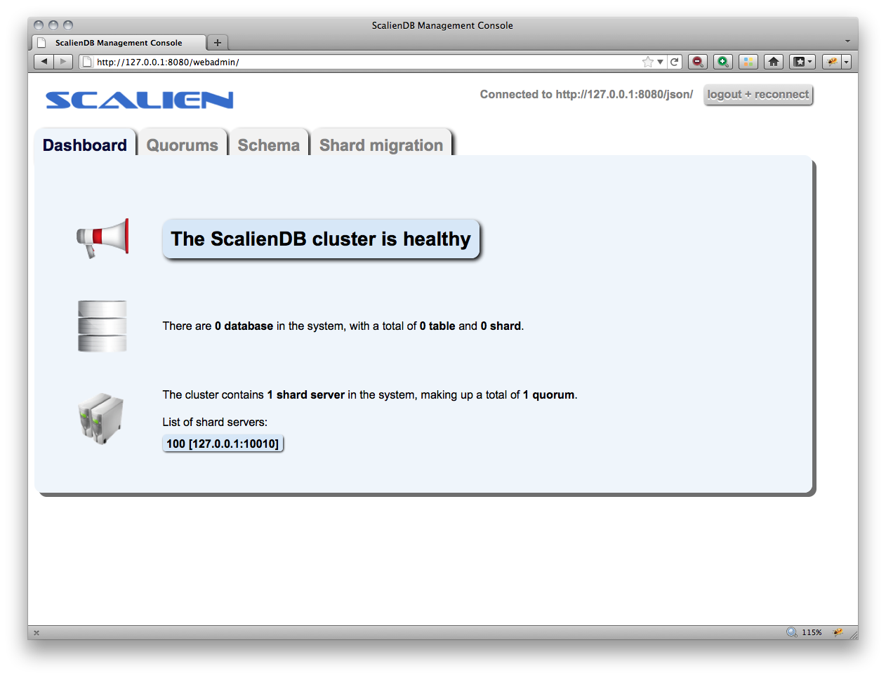
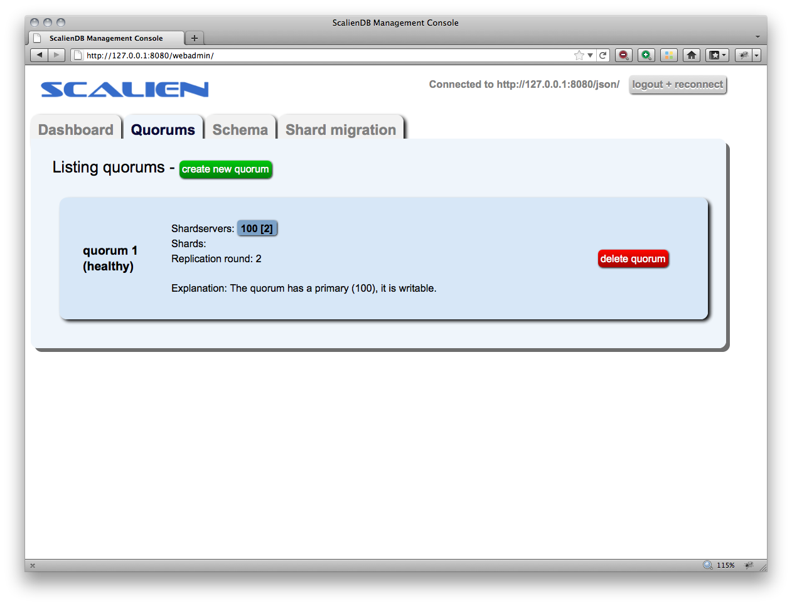
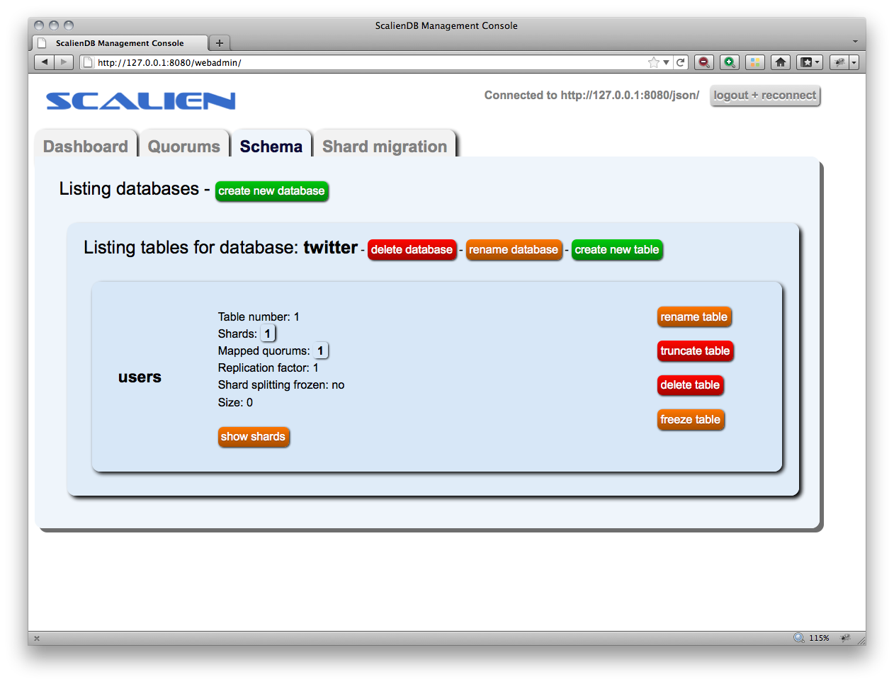

Python API Tutorial: Twitter
============================

Part I: Getting started
-----------------------

You're here! Great. Let's get started.

First, let's install ScalienDB. That's pretty easy, just fetch it from github::

  $ git clone git://github.com/scalien/scaliendb.git scaliendb

This created a directory called ``scaliendb``. Now to build it::

  $ cd scaliendb
  $ make
  $ make pythonlib

Great, we have ScalienDB and the python libraries ready to go.

A ScalienDB cluster consists of controllers and shard servers. Let's launch a single controller and a single shard server on ``localhost``::

  $ bin/scaliendb test/control/single/scaliendb.conf

and in another terminal::

  $ bin/scaliendb test/shard/0/scaliendb.conf

That's it, ScalienDB is running and eager to serve your NoSQL requests!

Let's make sure it's running all right by taking a look at the Web-based management console. Direct your browser to http://localhost:8080/webadmin, enter ``localhost:8080`` and log in. You should see something like this:

Before we go on, we need to create a quorum. Quorums are the units of replication in ScalienDB. If this sounds like rocket science, just ignore it for now, it will become clear later on. Click on the ``Quorums`` tab in the Web console and click ``Create new quorum``, enter ``100`` in the shard server list and press ``Create``. You should see:

Everything is running, time to get down to business! Let's write a simple Twitter test program for ScalienDB.

We'll start with a very simple schema and add features as we go along.

First, let's create a database and some tables. There are multiple ways to do this, we can either click through on the Web console or use the console line interface (CLI).

Let's use the Web console. Select the ``Schema`` tab and click ``Create new database``, enter ``twitter`` for the database name and press ``Create``. From now on we will be working in this database. Now, create a table by clicking ``Create new table`` to store our users, call it ``users``. You should see:

Let's get back to programming. We will be using Python for this tutorial, so you need the python libraries, which we have already built. Just copy all the files in ``bin/pythonlib`` to where your test Python script will be. Eg. if your Python program is in ``~/test`` and ScaliendB is in ``~/scaliendb``, then type::

  $ cp ~/scaliendb/bin/python/* ~/test/ 

You should see::

  ~/test $ ls -l
  total 1696
  -rwxr-xr-x  1 mtrencseni  staff  816552 Jun  6 17:56 _scaliendb_client.so
  -rw-r--r--  1 mtrencseni  staff   27921 Jun  6 17:56 scaliendb.py
  -rw-r--r--  1 mtrencseni  staff   11589 Jun  6 17:56 scaliendb_client.py

For starters, let's make sure everything works with a Hello World! program::
  
  import scaliendb
  client = scaliendb.Client(["localhost:7080"])
  db = client.get_database("twitter")
  table = db.get_table("users")
  table.set("foo", "Hello World!")
  value = table.get("foo")
  print(value) # should print Hello World!

Running::

  ~/test $ python test.py
  Hello World!

You can see we created a ``Client`` object, we got the table for ``users``, and we used ``set()`` and ``get()``. It turns out that you can go very far with simple operations like this, and in many cases, if you change your schema frequently or you want your system to scale, then it's actually a good idea to manage data like this!

Part II: Simple Twitter framework
---------------------------------

Let's scratch the Hello World! program and write something a little bit more complicated. This is not going to be a full Twitter framework, just something to show you how to get started with ScalienDB.

Let's create some more tables, call them ``indices``, ``tweets``, ``followers``, ``following``, ``index_users_username`` and ``cached_tweets``.

We will use the ``indices`` table to keep track of our object id counters (like ``AUTO_INCREMENT PRIMARY KEY`` columms in Mysql). There are two kinds of objects, ``users`` and ``tweets``, so we need two counters. To make thing simpler, let's put all our schema stuff in a ``setup_schema()`` function::

  def setup_schema():
    if not client.exists_database("twitter"): client.create_database("twitter")
    db = client.get_database("twitter")
    db.create_empty_table_cond("indices")
    db.create_empty_table_cond("users")
    db.create_empty_table_cond("tweets")
    db.create_empty_table_cond("followers")
    db.create_empty_table_cond("following")
    db.create_empty_table_cond("index_users_username")
    db.create_empty_table_cond("cached_tweets")
    indices = db.get_table("indices")
    indices.set("users", 0)    # init counter to 0
    indices.set("tweets", 0)   # init counter to 0

``create_empty_table_cond()`` creates the table if it does not exist, and truncates it if it does.

Going forward, it's going to be easier if we create global table objects for our ScalienDB tables::

  db = client.get_database("twitter")
  indices = db.get_table("indices")
  users = db.get_table("users")
  tweets = db.get_table("tweets")
  followers = db.get_table("followers")
  followings = db.get_table("following")
  index_users_username = db.get_table("index_users_username")
  cached_tweets = db.get_table("cached_tweets")

First, we want to be able to register new users. We want to assign a ``user_id`` to each one of them. We need to (atomically) increase the value of indices.users and return the value. That's just what the ``add()`` function is for::

  def new_id(key):
    return indices.add(key, 1)

For example, ``new_id("users")`` returns the next ``user_id`` to assign.

Let's write the function ``create_user()`` which takes a Python dictionary like this::

  {user_id: 1, username: "joe", password: "pass1", interests: "Foo and bar!", ... }

We will use the standard Python ``pickle`` package to serialize and de-serialize Python objects. Package ``pickle`` contains the functions ``dumps()`` and ``loads()``, which will take any Python object and turn it into a string which we can store in ScalienDB. The exact details of ``pickle`` don't matter. So::

  from pickle import loads, dumps
  from datetime import datetime

  def set_user(user):
    # store entire Python obj: user_id => obj
    users.set(user["user_id"], dumps(user))
    # store username index: username => user_id
    index_users_username.set(user["username"], user["user_id"])
    # new user has no followers, so store an empty list: user_id => []
    followers.set(user["user_id"], dumps([]))
    # new user is not following anyone, so store an empty list: user_id => []
    followings.set(user["user_id"], dumps([]))
    # new user's stream is empty, so store an empty list: user_id => []
    cached_tweets.set(user["user_id"], dumps([]))

  def create_user(username, password, interests):
    user = {}
    user["user_id"] = new_id("users")
    user["username"] = username
    user["password"] = password
    user["interests"] = interests
    user["datetime"] = datetime.now()
    set_user(user)
    return user

We can now store users. Let's write the function ``authenticate_user()``::

  def get_user_by_username(username):
    user_id = index_users_username.get(username)
    user = loads(users.get(user_id))
    return user
	
  def authenticate_user(username, password):
    user = get_user_by_username(username)
    if user is None: return False
    if user["password"] != password: return False
    return True

Let's see if it works::

  tu1 = create_user("test_user1", "password1", "Foo and bar")
  tu2 = create_user("test_user2", "password1", "Foo and bar")
  tu3 = create_user("test_user3", "password1", "Foo and bar")
  tu4 = create_user("test_user4", "password1", "Foo and bar")

  print(authenticate_user("test_user1", "bad_password"))  # prints False
  print(authenticate_user("test_user1", "password1"))     # prints True
	
Next, let's allow users to follow each other::

  def follow(follower, following):
    follower_id = follower["user_id"]
    following_id = following["user_id"]
    # get list of user_ids that the user is currently following, append and write back
    li = loads(followers.get(following_id))
    li.append(follower_id)
    followers.set(following_id, dumps(li))
    # get list of user_ids that are currently following the other user, append and write back
    li = loads(followings.get(follower_id))
    li.append(following_id)
    followings.set(follower_id, dumps(li))

  def get_follower_ids(user_id):
    return loads(followers.get(user_id))

Now we can have the different test users follow each other, like::

  follow(tu1, tu2)
  follow(tu1, tu3)
  follow(tu1, tu4)
  follow(tu4, tu2)

Things are looking good. Let's enable our users to actually send tweets through our toy framework. We will first fetch a ``tweet_id`` for our tweet and store it in the ``tweets`` table. Then, we will put it into the ``cached_tweets`` table (in other words the stream) of the user and all his followers. We are caching 200 tweets for each user::

  def tweet_message(user, message):
    # save tweet
    tweet = {}
    tweet["tweet_id"] = new_id("tweets")
    tweet["user_id"] = user["user_id"]
    tweet["username"] = user["username"]
    tweet["datetime"] = datetime.now()
    tweet["message"] = message
    tweets.set(tweet["tweet_id"], dumps(tweet))
    # cache last 200 tweets for user
    li = loads(cached_tweets.get(tweet["user_id"]))
    li.append(tweet["tweet_id"])
    if len(li) > 200: li.pop()
    cached_tweets.set(tweet["user_id"], dumps(li));
    # cache last 200 tweets for followers
    follower_ids = get_follower_ids(tweet["user_id"])
    for follower_id in follower_ids:
      li = loads(cached_tweets.get(follower_id))
      li.append(tweet["tweet_id"])
      if len(li) > 200: li.pop()
      cached_tweets.set(follower_id, dumps(li))

That's it! Now we can let our test users tweet::

  tweet_message(tu1, "Hello world!")
  tweet_message(tu2, "And Hello to you!")

Printing the cached stream for each user is easy, too. We just fetch the associated list of ``tweets_ids`` from ``cached_tweets``, get each tweet, and print it::

  def print_stream(user):
    print("+ %s's stream:" % user["username"])
    tweet_ids = loads(cached_tweets.get(user["user_id"]))
    for tweet_id in tweet_ids:
      tweet = loads(tweets.get(tweet_id))
      print("  %s: %s" % (tweet["username"], tweet["message"]))

Part III: Adding indexes
------------------------

What happens if a user follows another user who already has some existing tweets? The ``follow()`` function above does not add any existing tweets to the users' cache. We could solve this in a variety of ways, for example by having a per-user cache of each users' last 200 tweets. But what if we want to query more than 200 tweets? The solution is to add a generic index on the ``tweets`` table so we can query each users' tweets in chronological order.

ScalienDB does not support indexes out of the box, so we will create the index by hand. ScalienDB supports listing the keys (and values) of tables in lexicographical order by specifying a key prefix and a start key. So we will create an index by putting the indexed columns in the key. 

Create a table ``index_tweets_datetime`` and add the appropriate line to the ``setup_schema()`` funtion::

  db.create_empty_table_cond("index_tweets_datetime")

Create a global object for the new table::

  index_tweets_datetime = db.get_table("index_tweets_datetime")

We want to separate different users' tweets and sort them by datetime. So we will use the ``/user_id/datetime => tweet_id`` scheme for the index, paying attention to prefix the user_id's with 0's to make sure lexicographical sorting works. Fortunately, the ScalienDB Python library has a special ``composite()`` function to generate such keys for index table. All we have to add to our ``tweet_message()`` function is::

  # save tweet index by user_id/datetime
  index_tweets_datetime.set(scaliendb.composite(tweet["user_id"], tweet["datetime"]), tweet["tweet_id"])

For example, if the ``user_id`` is 55, the datetime is ``2011-06-02 18:00:35.296616`` and ``tweet_id`` is 33, this generates the key-value pair::

  /000000000000000000055/2011-06-02 18:00:35.296616 => 000000000000000000033

in the ``index_tweets_datetime`` table. For example, if we want to print 1000 tweets by ``user_id = 55`` starting at ``2011-01-01 00:00:00``, we can issue::

  kvs = index_tweets_datetime.list_key_values(prefix=scaliendb.composite(55, "2011-01-01 00:00:00"), count=1000)
  for key, tweet_id in sorted(kvs.items()):
    tweet = loads(tweets.get(tweet_id))
    print(tweet)
  
That's it!